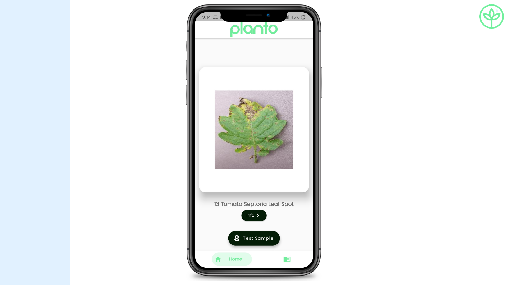

# planto

## Inspiration

Planto has been developed for the farming sector. In India, farmers are major stakeholders and 70% of the population is involved in farming. Having such a huge emphasis on the country, more attention should be paid to this sector's development and growth.

## Target Audience

This app mainly targets the farmers whether large scale or small scale. Farming holds a significant share in the country's GDP, and even some small mistakes can impact the economy. The main purpose of this application is to help the farmers deal with certain issues that can play a major role in destroying the whole crop and make it difficult for them to earn a living. These issues can be handled on the ground level and can save the farmers from losses and can help contribute to an even larger share in the GDP of the nation.

## Features

### 1. Plant Disease Prediction

Our app is user-friendly and has been built keeping in mind the difficulties that the farmers face and provides them the solution as well. Planto focuses on the condition of leaves. It scans the leaves and informs the farmer about any discrepancy that may arise in a long run and help them save their plantation from getting destroyed.

### 2. Disease Information & Management

:white_check_mark: Our app also guides them and shows the remedies that should be adopted in order to deal with the situation at hand. It also states the symptoms that help farmers to understand more about the problem and what all can be done to protect their plants.

:white_check_mark: It gives them a heads up about it and highlights the precautionary steps that the farmer can consider to prevent the disease altogether.

## Tech Stack

Database: [Firebase](https://firebase.google.com/)

Machine Learning Model: [Python](https://www.python.org/)

Code: [Flutter](https://flutter.dev/)

Prototype: [Adobe XD](https://www.adobe.com/in/products/xd.html)

## Requirements:

#### Hardware

<ul>
  <li>macOS, Windows or Linux</li>
  <li>At least 8GB of RAM recommended</li>
</ul>

#### Software (for development)

<ul>
  <li>A code editor (VS Code or Android Studio preferred)</li>
</ul>

#### Software (for testing)

<ul>
  <li>Android 5.0 or higher (minimum API Level 21 recommended)</li>
</ul>

## Instructions to run the project locally

1. Clone the repository and go to the root folder of the project, named `planto` in any editor (VS Code preferred).
2. Inside the root folder, open `pubspec.yaml` file and in the terminal run the command `flutter pub get`.
3. Once the command has been execued, go in the folder named `lib` and open the file named `main.dart`.
4. After opening the file, run the command `flutter run` in the terminal to start the android application.

Note: For testing the application, some images of each class are stored in `test_images` folder. Download those images to test out the application.
